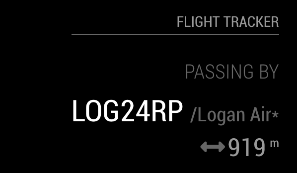
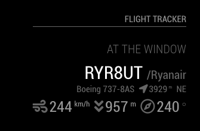
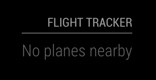

# MagicMirror Module: Flight Tracker

`MMM-FlightTracker` is a module for [MagicMirror](https://github.com/MichMich/MagicMirror) that allows you to display
real time information about gather from nearby planes transponders. The data is received over radio signals, coming from
nearby planes that is gather through an [ADS-B receiver](https://en.wikipedia.org/wiki/Automatic_dependent_surveillance_%E2%80%93_broadcast)
(this is how [FlightRadar24](https://www.flightradar24.com/) gets most of its data)
connected directly to server running MagicMirror, or over a TCP stream of SBS1 messages.







## Usage

### Prerequisites

This module requires that you have [librtlsdr](https://github.com/steve-m/librtlsdr) installed on your system. 

Homebrew (macOS):
```
brew install librtlsdr
```

Debian based Linux distros:
```
apt-get install librtlsdr-dev
```

It also requires to have either:
- a ADS-B receiver plugged in to the server running MagicMirror. There are inexpensive to buy
  and you can find [a lot of them on Amazon](https://www.amazon.co.uk/s?k=ads-b&ref=nb_sb_noss_2).
- a feeder from FlightAware or FlightRadar24 with [dump1090 configured to expose SBS1 messages over TCP](https://github.com/antirez/dump1090#port-30003).

### Setup

Clone this module into your MagicMirror's `modules` directory and install the dependencies:

```sh
cd modules
git clone https://github.com/tbouron/MMM-FlightTracker
npm i
```

then add the module to your MagicMirror's configuration. Here is an example:

```javascript
/* MagicMirror/config/config.js */
{
    /* ...your other config here */

    modules: [

        /* ...your other modules here */

        {
            module: 'MMM-FlightTracker',
            header: 'Nearby planes',
            position: 'top_left',
            config: {
                interval: Number,
                animationSpeed: Number,
                passingByThreshold: Number,
                speedUnits: 'metric|imperial',
                altitudeUnits: 'metric|imperial',
                client: {
                    mode: 'rtlsdr|network',
                    host: 'acme.com',
                    port: 30003
                }
            }
        }
    ]
}
```

### Configuration options

| Configuration key | Description | Default | Required |
| --- | --- | --- | --- |
| interval | Interval to check if new planes are nearby. This value is in _seconds_ | 1 | Yes |
| animationSpeed | Animation speed to display/hide the module when planes come and go. This value is in _milliseconds_ | 1000 | No |
| passingByThreshold | The threshold altitude to determine if a plane is "at the window" or just "passing by". If no set (or negative) then all planes will be treated the same way | -1 | No |
| speedUnits | The unit to use for speed. By default, it will use the unit defined at the global config. Can be `metric` or `imperial`. | Global unit config | Yes |
| altitudeUnits | The unit to use for altitude. By default, it will use the unit defined at the global config. Can be `metric` or `imperial`. | Global unit config | Yes |
| client | The configuration for the ADS-B client. By default, the mode is set to `rtlsdr` (not other options are needed in this mode). In case of `network` mode, options `host` and `port` are required. | `{mode: 'rtlsdr'}` | No |
